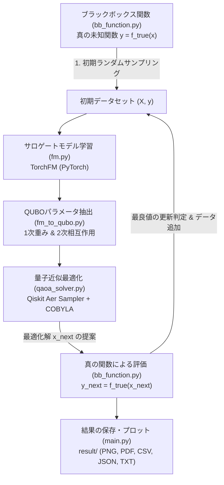

# QAOA_BBO コード構造・モジュール詳細解説

本ドキュメントは、**QAOA_BBO_Public** リポジトリにおける全体アーキテクチャ、制御フロー、および各 Python スクリプト（`.py`）の詳細な役割と数理仕様を解説するものです。

---

## 1. 全体アーキテクチャとBBOクローズドループ

本リポジトリは、目的関数の数式が未知であるブラックボックス最適化（Black-Box Optimization: BBO）に対し、**Factorization Machine (FM)** によるサロゲートモデリングと、**Quantum Approximate Optimization Algorithm (QAOA)** による量子サンプリングを組み合わせたクローズドループ最適化システムです。

### 1.1 最適化ループの処理フロー


1. **初期データ生成 (`bb_function.py`)**:
   - 探索空間 $\{0, 1\}^d$ から少数の初期候補（デフォルト: 10点）をランダム生成し、真の関数値を取得。
2. **代理モデル学習 (`fm.py`)**:
   - 収集済みデータセットを用いて、特徴量間の2次相互作用を捉える Factorization Machine を学習。
3. **QUBOへの等価変換 (`fm_to_qubo.py`)**:
   - 学習したFMの重みパラメータ（線形項と潜在ベクトルの内積）から、QAOAが解くべき QUBO 辞書 `{(i, j): weight}` を導出。
4. **QAOAによる最適解探索 (`qaoa_solver.py`)**:
   - Qiskit の QAOA アルゴリズムを用いて QUBO ハミルトニアンの基底状態を探索し、最も有望なビット列 $\bm{x}_{\mathrm{next}}$ をサンプリング。
5. **実験評価とフィードバック更新 (`main.py`)**:
   - 得られた候補 $\bm{x}_{\mathrm{next}}$ を真の関数で評価し、データセットに追加して次サイクルへ反復。

---

## 2. ファイル一覧と役割対照表

| ファイル名 | 分類 | 主な役割・機能 |
| :--- | :--- | :--- |
| [`main.py`](./main.py) | メイン制御 | BBOクローズドループの統括実行、データ更新、結果可視化・保存 |
| [`config.yaml`](./config.yaml) | 設定管理 | 問題の次元数 $d$、学習パラメータ、QAOA設定などの一元管理 |
| [`bb_function.py`](./bb_function.py) | 真の目的関数 | 未知関数の模擬（ランダムQUBO）、評価計算、真の最小値全探索 |
| [`fm.py`](./fm.py) | 機械学習モデル | PyTorchによる Factorization Machine (FM) のモデル定義（$O(kd)$ 高速計算法） |
| [`fm_to_qubo.py`](./fm_to_qubo.py) | パラメータ変換 | 学習済みFMパラメータ（$W, V$）からQUBO辞書形式への厳密変換 |
| [`qaoa_solver.py`](./qaoa_solver.py) | 量子ソルバー | Qiskit公式準拠のQAOAソルバー（$d \ge 20$ のIndexErrorパッチ完備） |
| [`utils.py`](./utils.py) | ユーティリティ | `Logger`（標準出力＆ファイル同時記録）、FM予測最小値の全探索ヘルパー |
| `pyproject.toml` | 依存管理 | uv / PEP 621 準拠のプロジェクト設定・依存パッケージ定義 |
| `requirements.txt` | 依存管理 | pip 用の依存ライブラリ一覧（Qiskit, PyTorch, NumPy 等） |

---

## 3. 各モジュール（.pyファイル）の詳細解説

### 3.1 `main.py` (メイン制御スクリプト)
- **概要**: BBOループ全体の進行と結果出力を一括制御するエントリポイント。
- **処理シーケンス**:
  1. **設定の読み込み**:
     - `config.yaml` を絶対パスで解決して読み込み（作業ディレクトリに依存しない設計）。
     - シード固定（PyTorch, NumPy）による実験の再現性確保。
  2. **結果保存用ディレクトリの自動作成**:
     - `result/txt/`: コンソールログ
     - `result/json/`: 構造化結果データ
     - `result/csv/`: グラフ描画用CSV
     - `result/png/` & `result/pdf/`: 最適化推移グラフ
  3. **ログの二重化**:
     - `sys.stdout` を `Logger` でラップし、画面表示とログファイル記録を並行実行。
  4. **BBO反復ループ**:
     - 毎サイクルでFMモデルを新規初期化し、現行データセットで Adam 最適化。
     - FM重みから QUBO を構築し、`solve_qubo_qaoa` で次候補を探索。
     - 真のBB関数で候補を評価し、既存最良値（Best-so-far）を更新していれば記録。
  5. **最終出力**:
     - 全探索による真の最小値（理論限界線）と、QAOAが探索した推移曲線を重ねてプロット・保存。

---

### 3.2 `config.yaml` (設定ファイル)
- **概要**: 実験条件をコードを変更することなく調整するための設定ファイル。
- **主要設定項目**:
  ```yaml
  seed: 42                  # 乱数シード
  d: 5                      # 最適化問題のバイナリ変数数（量子ビット数 N = d）
  k: 2                      # FMモデルの潜在ベクトル次元数
  num_initial_samples: 10   # 初期観測データ数
  num_bbo_cycles: 5         # BBOを回す反復サイクル数
  epochs: 150               # 各サイクルでのFM学習エポック数
  lr: 0.1                   # FM学習の学習率 (Adam)
  qaoa_reps: 1              # QAOAのレイヤー数 (p)
  qaoa_maxiter: 50          # 古典オプティマイザ (COBYLA) の最大反復回数
  ```

---

### 3.3 `bb_function.py` (ブラックボックス目的関数モジュール)
- **概要**: 実験室での材料合成や分子物性評価に見立てた「真の目的関数」を定義・評価するモジュール。
- **数理モデル**:
  - 本リポジトリでは検証用として、ランダムに生成された上三角QUBO行列 $Q$ による二次形式を真の関数として採用：
    $$y = f_{\mathrm{true}}(\bm{x}) = \bm{x}^T Q \bm{x} = \sum_{i=1}^d \sum_{j=i}^d Q_{ij} x_i x_j$$
- **主要関数**:
  - `create_random_qubo_bb(d, seed)`: 一様乱数 $[-1, 1]$ から $d \times d$ の上三角行列 $Q$ を生成。
  - `evaluate_bb(x, Q)`: 入力バッチ $\bm{x} \in \{0, 1\}^{B \times d}$ に対し、`np.einsum('ni,ij,nj->n', x, Q, x)` で高速に行列積を並列評価。
  - `generate_dataset(Q, num_samples, d, seed)`: ランダムバイナリ入力を生成し、ラベル付けした PyTorch テンソル $(X, y)$ を生成。
  - `get_exact_minimum_bb(Q, d)`: 全 $2^d$ 通りのビット列を総当たり評価し、真の理論最小値 $y^*$ と最適ビット列 $\bm{x}^*$ を算出（アルゴリズムの到達度検証に使用）。

---

### 3.4 `fm.py` (Factorization Machine サロゲートモデル)
- **概要**: 疎な二値入力に対して高精度に相互作用を学習できる機械学習モデル（Rendle, 2010）。
- **数理モデル**:
  $$\hat{y}(\bm{x}) = w_0 + \sum_{i=1}^d w_i x_i + \sum_{i=1}^d \sum_{j=i+1}^d \langle \bm{v}_i, \bm{v}_j \rangle x_i x_j$$
  - $w_0 \in \mathbb{R}$: グローバルバイアス（定数項）
  - $\bm{w} \in \mathbb{R}^d$: 各ビットの1次線形重み
  - $\bm{v}_i \in \mathbb{R}^k$: 各特徴量に割り当てられた $k$ 次元の潜在因子ベクトル
- **$O(kd)$ 計算のメカニズム**:
  - 通常の2次相互作用の総和計算は $O(k d^2)$ の計算量を要しますが、以下の展開公式により $O(kd)$ で順伝播を計算：
    $$\sum_{i=1}^d \sum_{j=i+1}^d \langle \bm{v}_i, \bm{v}_j \rangle x_i x_j = \frac{1}{2} \sum_{f=1}^k \left[ \left( \sum_{i=1}^d v_{i, f} x_i \right)^2 - \sum_{i=1}^d v_{i, f}^2 x_i^2 \right]$$
  - `TorchFM(nn.Module)` クラスとして実装され、PyTorch の Autograd による高速な勾配降下法（Adam）で学習されます。

---

### 3.5 `fm_to_qubo.py` (FM重みからQUBOへの変換モジュール)
- **概要**: 学習が完了した `TorchFM` の内部重みを行列抽出し、量子アニーラやQAOAが解ける QUBO 形式へ変換するモジュール。
- **変換の数理対応**:
  1. **1次項 ($i == j$)**:
     $$Q_{ii} = w_i \quad (\text{model.lin.weight}[i])$$
  2. **2次項 ($i < j$)**:
     $$Q_{ij} = \langle \bm{v}_i, \bm{v}_j \rangle = \sum_{f=1}^k v_{i, f} v_{j, f} \quad (\text{model.V}[i] \cdot \text{model.V}[j])$$
  3. **定数項 (offset)**:
     $$\text{offset} = w_0 \quad (\text{model.lin.bias})$$
- **戻り値**:
  - `qubo`: `{(i, j): weight}` の辞書形式。
  - `offset`: スカラー浮動小数点数。

---

### 3.6 `qaoa_solver.py` (Qiskit QAOA ソルバー)
- **概要**: QUBO辞書を受け取り、Qiskit公式のアルゴリズムスタックを用いてQAOAを実行するソルバー。
- **主要な処理コンポーネント**:
  1. **`QuadraticProgram` の自動構築**:
     - 変数数 $N = \max(i, j) + 1$ を特定し、バイナリ変数 $x_0, \dots, x_{N-1}$ を登録。
     - 目的関数 $\min \sum Q_{ii} x_i + \sum Q_{ij} x_i x_j + \text{offset}$ を構築。
  2. **Qiskit Aer 高速シミュレーション**:
     - `AerSampler`（高速なC++バックエンド）を使用。
     - トランスパイラプリセットマネージャ（`generate_preset_pass_manager`）により回路最適化レベル1で実行。
     - 古典最適化器として `COBYLA(maxiter=maxiter)` を使用し、QAOAパラメータ $(\bm{\gamma}, \bm{\beta})$ を探索。
  3. **大規模問題 ($d \ge 20$) におけるバグ回避パッチ**:
     - Qiskit Optimization の `MinimumEigenOptimizer` では、内部で `min_probability=1e-6` の足切り閾値がハードコードされています。
     - 変数数が $d \ge 20$（状態数 $2^{20} \approx 105$ 万通り）に達すると、一様分布に近い量子状態の測定確率は $1/2^{20} \approx 9.5 \times 10^{-7} < 10^{-6}$ となり、**全サンプルがノイズとみなされて除外され `IndexError`（空リスト参照）でクラッシュする**問題が発生します。
     - 本モジュールでは `oa.OptimizationAlgorithm._eigenvector_to_solutions` を動的にパッチし、閾値を $0.0$ または $-1.0$ に安全にフォールバックさせることで、大規模問題でもクラッシュせず安定動作させます。

---

### 3.7 `utils.py` (ユーティリティモジュール)
- **`Logger` クラス**:
  - `sys.stdout` をオーバーライドし、ターミナルへの標準出力（画面表示）と同時に、指定したファイル（`result/txt/output_YYYYMMDD_HHMMSS.txt`）へリアルタイムにテキスト保存します。
- **`get_fm_minimum(model, d)`**:
  - 学習したFMモデルに対し、全 $2^d$ パターンの入力を評価して「FMが予測している最小値とその解」を全探索で算出します。
  - QAOAが「FMの予測最小解をどれだけ忠実に探索できたか」を切り分け分析するための検証関数です。

---

## 4. 入出力データとディレクトリ構成

プログラムを実行すると、カレントディレクトリに `result/` が自動生成されます：

```
result/
├── txt/    # output_20260911_143000.txt (ターミナルの完全実行ログ)
├── json/   # bbo_result_20260911_143000.json (提案解・真値・予測値の構造化データ)
├── csv/    # bbo_history_20260911_143000.csv (BBO各サイクルの最良値推移)
├── png/    # bbo_history_20260911_143000.png (最適化推移グラフ画像)
└── pdf/    # bbo_history_20260911_143000.pdf (高解像度ベクターグラフ)
```

---

## 5. 実行方法

### uv を使用する場合（推奨）
```bash
uv run python main.py
```

### 通常の pip / venv を使用する場合
```bash
# 仮想環境作成・有効化
python -m venv .venv
source .venv/bin/activate    # Mac / Linux
# .\.venv\Scripts\Activate.ps1  # Windows PowerShell

# インストールと実行
pip install -r requirements.txt
python main.py
```
