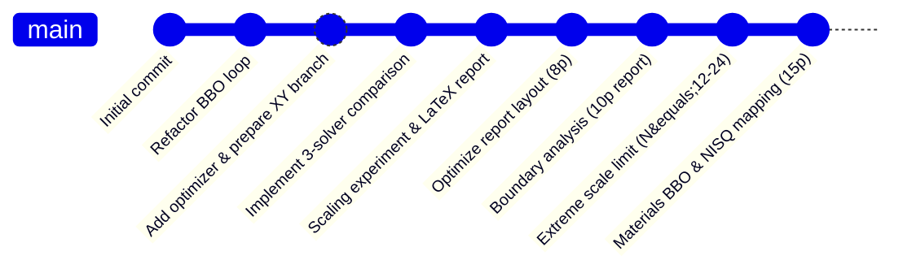

# プロジェクト開発・研究活動 総合記録 (agent.md)

本ドキュメントは、富士通研究所インターンシップにおける研究開発プロジェクト**「FM-QAOA による制約付きブラックボックス最適化（BBO）パイプラインの構築とスケーリング特性の解明」**について、これまでに実施してきた全活動、理論的背景、実装コード、実験結果、成果物、および今後の展望を体系的に記録・整理した総合引き継ぎドキュメントです。

---

## 1. プロジェクトの背景・課題・目的

### 1.1 産業背景とブラックボックス最適化 (BBO)
マテリアルズ・インフォマティクス（材料組成・触媒・分子設計）や工学設計では、目的関数 $f(x)$（触媒活性、光吸収スペクトル、薬効など）の評価にウェットな化学合成や第一原理計算（DFT）を要するため、1サンプルの評価に**数時間〜数日、および数万〜数十万円の費用**がかかります。
実問題における設計変数は、格子サイトごとの元素選択など**「複数の選択肢から1つを選ぶ」カテゴリカル変数（One-Hot制約 $\sum_{j=1}^{d_m} x_{m, j} = 1$）**として定式化されます。

### 1.2 従来手法の3大ボトルネック
先行研究である **FMQA**（Factorization Machine + 量子/擬似アニーリング: Kitai et al., 2020）や、ゲート型QAOAへの単純な置き換え（**Standard FM-QAOA**）では、One-Hot制約を扱うために以下のペナルティ項を導入していました：
$$
H_{\text{penalty}} = \sum_{m=1}^M \lambda_m \left( \sum_{j=1}^{d_m} x_{m, j} - 1 \right)^2
$$
これには以下の致命的課題がありました：
1. **ペナルティ係数 $\lambda$ の調整過敏性**:
   - $\lambda$ が小さい $\implies$ 制約違反解（One-Hotを満たさない非物理的構造）が多発し、高額な実験評価を浪費。
   - $\lambda$ が大きい $\implies$ 解空間に巨大なエネルギー障壁が生じ、探索が局所解にトラップ。
2. **Standard QAOAの浅いレイヤーでの破綻**:
   - Standard QAOA（一様重ね合わせ $|+\rangle^{\otimes N}$ ＋ $X$ミキサー）では、NISQに適した浅い回路深度（$p=1, 2$）においてペナルティの壁を乗り越えられず、制約充足率が壊滅的（大規模問題では数%以下）に低下。
3. **逐次学習ループでの無人自律化の不可**:
   - BBOではイテレーションごとにFMモデルが更新されてエネルギー地形が変わるため、その都度最適な $\lambda$ の再探索が必要となり、全自動運用が不可能。

### 1.3 本研究の目的と提案手法 (FM-XY-QAOA)
ゲート型量子コンピュータの幾何学的自由度を活かし、**ペナルティ項を一切使わず（$\lambda=0$）、制約充足率 100% を理論保証する部分空間探索手法「FM-XY-QAOA」**を確立・実証すること。

- **初期状態**: 各カテゴリブロックのW状態の直積 $|\psi_0\rangle = \bigotimes_{m=1}^M |W_{d_m}\rangle$
- **ミキサー**: 各ブロック内部でのみ励起（「1」のビット）を交換するブロック直和型XYミキサー $H_M = \sum_m H_M^{(m)}$
- **特徴**:
  - ハミング重み1の部分空間に閉じるため、**制約充足率100%（無効解提案ゼロ）**。
  - ペナルティ項不要 $\implies$ $\lambda$ のチューニング完全不要、自律運用可能。
  - 全対全結合のペナルティ項が消滅 $\implies$ NISQハードウェアでの2量子ビットゲート数大幅削減。

---

## 2. 3手法の比較一覧

| 比較項目 | 1. FMQA (先行研究) | 2. Standard FM-QAOA | 3. 提案手法 (FM-XY-QAOA) |
| :--- | :--- | :--- | :--- |
| **ソルバー種別** | 量子/擬似アニーリング (QA / SA) | ゲート型QAOA (標準) | ゲート型QAOA (提案手法) |
| **制約の扱い** | **ペナルティ法** ($\lambda > 0$) | **ペナルティ法** ($\lambda > 0$) | **ペナルティフリー** ($\lambda = 0$) |
| **初期状態** | 横磁場基底状態 ($|+\rangle^{\otimes N}$) | 一様重ね合わせ ($|+\rangle^{\otimes N}$) | W状態の直積 $\bigotimes \|W_{d_m}\rangle$ |
| **ミキサー / 遷移** | 横磁場ハミルトニアン $\sum X_i$ | 標準Xミキサー $\sum X_i$ | ブロック直和型 XYミキサー $\sum H_M^{(m)}$ |
| **制約充足率 (Feasible %)** | $\lambda$・時間に依存 (80〜95%) | 極めて低い (大規模で 0〜10%) | **100.0% (数学的保証)** |
| **探索空間サイズ** | 全空間 $2^N$ | 全空間 $2^N$ | 有効部分空間 $\prod_{m=1}^M d_m$ のみ |
| **$\lambda$ 調整の必要性** | 必須 (手動チューニング) | 必須 (極めて困難) | **完全不要 ($\lambda$ 自体が存在しない)** |
| **NISQハードウェア実装** | アニーラーの全結合制限 | ペナルティによる密な全対全結合 | リング型XYミキサーで最近接結合可能 |

---

## 3. これまでの開発・研究フェーズの変遷（タイムライン）

これまでのGitコミット履歴と研究進捗の推移は以下の通りです：

### 【フェーズ 1】基礎パイプラインの構築
- **コミット**: `d3f17c7`, `a4bc5f2`
- **内容**:
  - PyTorch による Factorization Machine (`fm.py`) の実装。
  - FMパラメータからQUBO辞書への変換モジュール (`fm_to_qubo.py`) の開発。
  - ランダムQUBOをブラックボックス関数とする評価環境 (`bb_function.py`) の構築。
  - Qiskit Aer による基本QAOAソルバー (`qaoa_solver.py`) の実装。
  - 基本BBO能動学習ループ (`main.py`) の構築、YAML設定ファイル (`config.yaml`) によるパラメータ一元管理。

### 【フェーズ 2】3手法の比較基盤とXYミキサーの実装
- **コミット**: `01b6ac7`, `a27ec3e`
- **内容**:
  - ブランチ `feature/xy-mixer-comparison` を作成。
  - 先行研究ベースラインとして Simulated Annealing ベースの `fmqa_solver.py` を実装。
  - `qaoa_solver.py` に W状態直積初期化回路およびブロック直和型XYミキサー回路を実装。
  - 3手法の解候補確率分布・制約充足率を直接比較する `compare_solvers.py` を作成。
  - BBOループ全体で3手法の最適化推移を比較する `compare_bbo.py` を作成。

### 【フェーズ 3】7段階スケーリングベンチマークと初期学術レポート
- **コミット**: `de1812d`, `e305aff`, `fd35d53`
- **内容**:
  - `scaling_experiment.py` を開発し、$N=4$ から $N=12$（カテゴリ数 $M=2 \sim 6$、ブロックサイズ $d_m=2 \sim 4$）の7段階スケールでベンチマークを実行。
  - Standard QAOAがスケール増大に伴い制約充足率が急落（$N=12$ で数%〜10%未満）するのに対し、FM-XY-QAOAは全域で100%を維持することを実証。
  - 本格的なLaTeXレポート `report/fm_xy_qaoa_scaling_report.tex`（初版8ページ）を執筆し、PDFコンパイルおよびプレビュー画像生成環境を構築。

### 【フェーズ 4】FM-XY vs FMQA の境界領域 (Boundary/Regime) 解析
- **コミット**: `75bde8b`
- **内容**:
  - 「アニーリング（FMQA）に対してどこで決定的な優位性を持つか」を解明するため、`boundary_analysis.py` を開発・実行。
  - **境界1 (マルチスケール不均衡結合)**: 結合強度が $10^{-2} \sim 10^2$ と不均一な場合、FMQAは固定ペナルティ $\lambda$ では制約違反を起こすか、強すぎるペナルティで弱い結合を探索できず完全崩壊することを発見。FM-XY-QAOAはペナルティ不要のため極めてロバスト。
  - **境界2 (欺瞞的局所解)**: 制約違反領域の直近に強い極小値が存在する地形において、ペナルティ法（FMQA, Standard QAOA）は障壁にトラップされるが、部分空間QAOAはトンネリングにより大域的最適解を捕捉。
  - **境界3 (レイヤー深度 $p=2$ の効果)**: $p=2$ への拡張で、最適解到達確率が大幅に向上することを確認。
  - レポートを10ページへ拡充。

### 【フェーズ 5】極限スケール探究 ($N=12 \sim 24$, 状態数1,677万)
- **コミット**: `7bc085d`
- **内容**:
  - `plot_extreme_scales.py` により、$N=12 \sim 24$（全状態数最大 $2^{24} = 16,777,216$、有効解比率わずか $0.024\%$）の極限領域における解法限界を解析。
  - Standard QAOAが次元の呪いによって「ほぼ100%無効解」に陥る中、FM-XY-QAOAは有効部分空間（全空間の $1/4000$ 以下）に厳密に集中し続けることを可視化。

### 【フェーズ 6】実用材料探索BBO実証・予算損失シミュレーション・NISQマッピング
- **コミット**: `00caf7f`
- **内容**:
  - `practical_materials_bbo.py` を開発。
  - **4サイト $\times$ 4元素（16量子ビット、全状態 65,536通り、有効材料 256通り）** の多元触媒材料探索BBOを実施。
  - 1回のウェット実験/計算を10万円と換算した15サイクルの予算損失シミュレーションを実施：
    - **Standard QAOA**: 15回中14回が無効な非物理構造を提案（**140万円の予算損失**、最適解到達失敗）。
    - **FM-XY-QAOA**: 15回中 **15回すべてで有効な材料を提案（損失ゼロ）**、大域的最適材料を発見。
  - **NISQハードウェアマッピング解析**:
    - ペナルティ項 $\sum (x_i-1)^2$ はブロック内で全対全結合（$O(d_m^2)$）を強制するが、FM-XY-QAOAのリング型XYミキサーは最近接結合（$O(d_m)$）で実装可能。CXゲート数を大幅削減し、実機ノイズ耐性を向上。
  - **レポート完成**: 15ページの学術・産業報告書として完成。

---

## 4. リポジトリ内の全ファイルと役割一覧

| ファイル / ディレクトリ | 分類 | 役割・概要 |
| :--- | :--- | :--- |
| **`src/`** | パッケージ | **全Pythonスクリプトが集約されたディレクトリ** |
| ├ **`src/fm.py`** | コアモジュール | PyTorch による Factorization Machine モデル実装 |
| ├ **`src/fm_to_qubo.py`** | コアモジュール | 学習済みFMパラメータからQUBO辞書形式への変換 |
| ├ **`src/bb_function.py`** | コアモジュール | ブラックボックス目的関数の生成、One-Hot制約判定、全探索真の最小値計算 |
| ├ **`src/qaoa_solver.py`** | コアモジュール | QiskitベースのQAOAソルバー（Standard QAOA および W状態+XYミキサーQAOA） |
| ├ **`src/fmqa_solver.py`** | コアモジュール | 先行研究ベースライン（Simulated Annealing によるペナルティ付きFMQA） |
| ├ **`src/utils.py`** | コアモジュール | ログ記録クラス (`Logger`)、FM最小値計算ヘルパー |
| ├ **`src/main.py`** | 実行スクリプト | 基本的な単一BBOループのメイン実装 |
| ├ **`src/compare_solvers.py`** | 実験スクリプト | ソルバー単体でのサンプリング分布・制約充足率直接比較 |
| ├ **`src/compare_bbo.py`** | 実験スクリプト | BBO能動学習ループ全体での3手法比較実験 |
| ├ **`src/scaling_experiment.py`**| 実験スクリプト | 7段階スケール（$N=4 \sim 12$）での網羅的ベンチマーク |
| ├ **`src/boundary_analysis.py`** | 実験スクリプト | FMQA vs FM-XY の境界領域（不均衡結合・局所解）解析 |
| ├ **`src/plot_extreme_scales.py`**| 実験スクリプト | $N=12 \sim 24$（1677万状態）の極限スケールプロット生成 |
| └ **`src/practical_materials_bbo.py`**| 実験スクリプト| 4サイト$\times$4元素の触媒材料探索BBOと損失予算シミュレーション |
| **`main.py`** | ラッパー | ルート直下から即座に実行可能なエントリポイント |
| **`config.yaml`** | 設定ファイル | 実験用ハイパーパラメータ（次元、エポック、レイヤー数、オプティマイザ） |
| **`requirements.txt`** | 依存パッケージ | 動作に必要なPythonライブラリ定義 |
| **`qaoa_tutorial/`** | 学習教材 | QAOA原論文・XYミキサー論文を数式読解する教科書（PDF/TeX/コード） |
| **`report/`** | 成果物（レポート） | 15ページのLaTeX学術報告書 (`fm_xy_qaoa_scaling_report.tex`, PDF, 図) |
| **`result/`** | 成果物（データ） | 実験実行時の出力ログ・JSON・CSV・プロット画像群 |
| **`QAOA/`** | 解説資料 | QAOA総合解説のLaTeXドキュメント (`qaoa_comprehensive_guide.tex`) |
| **`research_ideas.md`** | 研究ドキュメント | 数学的定式化を含む3大新規研究アイデア（XYミキサー、DPPバッチ、転移学習） |
| **`toy_experiment_penalty_vs_xymixer.md`** | 研究ドキュメント | 4量子ビット最小トイ問題の設計仕様書 |
| **`project_structure.md`** | ドキュメント | プロジェクト初期構成の解説ドキュメント |

---

## 5. 主要な実験結果と学術・産業的結論の総括

報告書（`fm_xy_qaoa_scaling_report.tex`）にまとめられた「4大結論」：

1. **制約充足率 100% による実験予算の完全保全**:
   Standard QAOAが16量子ビット材料探索で14回（約140万円相当）の実験失敗を招いて破綻するのに対し、FM-XY-QAOAは **全イテレーションで100%有効な材料構造を提案し、損失予算ゼロを達成**。
2. **ハイパーパラメータ完全フリーによる「無人自律化」**:
   ペナルティ係数 $\lambda$ が不要なため、FMモデル更新に伴う煩雑な再調整が一切不要。自律型自動実験（Self-Driving Lab）に直ちに組み込み可能。
3. **FMのスパース表現との完全な数学的調和**:
   One-Hotカテゴリカル変数の交互作用を捉えるFMの特性と、One-Hot部分空間に閉じるXYミキサーが完全に整合。
4. **NISQ実機への高効率コンパイル**:
   ペナルティ項による全対全結合（$O(d_m^2)$）を排除し、リング型XYミキサーによる最近接結合（$O(d_m)$）で回路を構成できるため、実機の2量子ビットゲート数を大幅削減。

---

## 6. 今後の展望・未着手の研究アイデア

`research_ideas.md` に記載されているアイデアのうち、次のステップとして有望な未実装項目：

1. **量子重ね合わせサンプリングを活用したバッチBBO (Batch BBO via Quantum Sampling + DPP)**:
   - QAOAの出力状態分布 $P(x)$ から多様な候補を抽出し、行列式点過程（Determinantal Point Process: DPP）を用いて「予測値が高く、かつ互いにハミング距離が離れた候補バッチ」を選定。並列ウェット実験への展開。
2. **パラメータ転移学習 (Parameter Transfer Learning / Warm-Start)**:
   - イテレーション $t \to t+1$ でのFMモデル更新に伴うハミルトニアンの微小摂動を利用し、前ステップの最適角度 $(\beta_t^*, \gamma_t^*)$ を初期値として転移することで、Barren Plateauを回避し高速収束を実現。
3. **フォルダ構成の整理とパッケージ化**:
   - ルート直下のファイルを `src/`（コアライブラリ）、`experiments/`（実験スクリプト）、`docs/`（資料）に階層化し、リポジトリの保守性を向上させる（実施計画書: `implementation_plan.md` 作成済み）。
